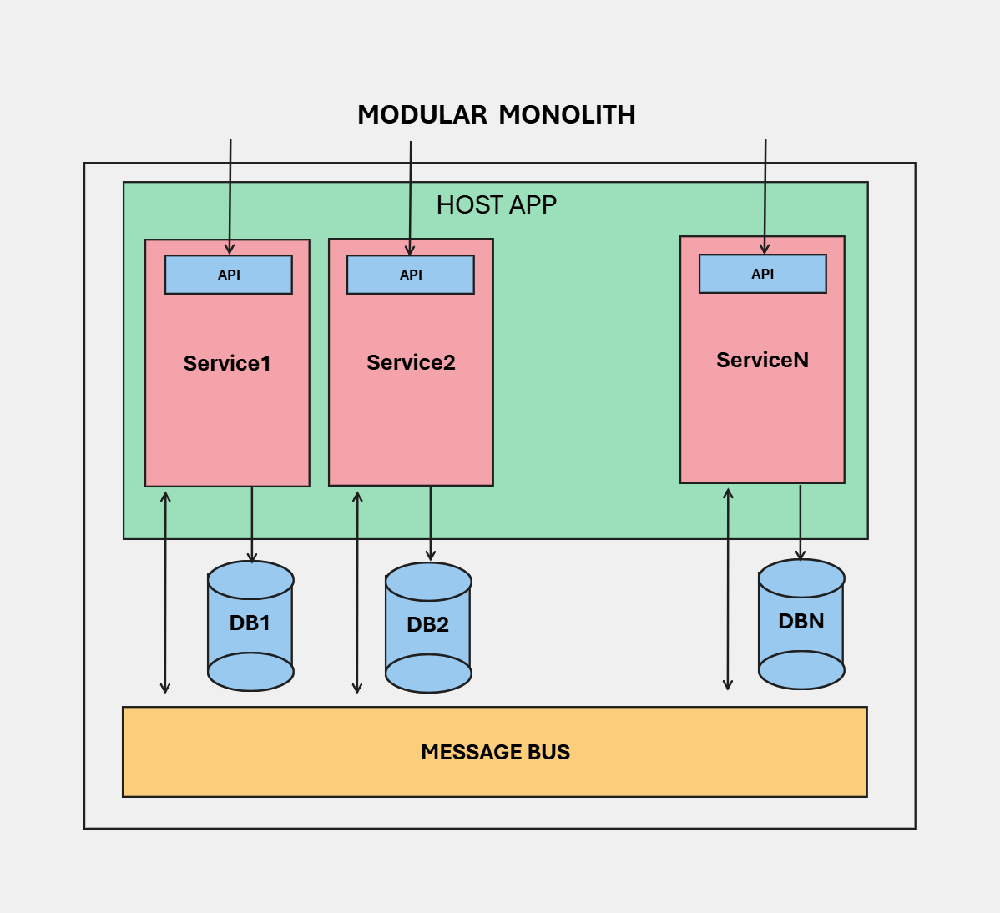

# Modular Monolith Template

This is a template for creating a modular monolith application utilizing vertical slice architecture. Each module is a separate project in the solution, the modules are then combined under a single Host at runtime. Internals of each module is only visible to Host and not to other modules, so that modules can interact with each other only through designated interfaces. Those interfaces may be:

- Through pub/sub messages shared between modules; all message contracts are in a project shared by every module,
- Through Orleans public grain interfaces shared between modules; this template doesn't contain any,
- Through web apis; though web apis would be better suited for consumption by external applications.

# Components

## Host

Host is a Web Application co-hosting Microsoft.Orleans server in same process. It is responsible for discovering and registering the modules and their dependencies at runtime along with db context migration jobs of the modules at startup and message publishing jobs from db outbox tables to message bus.

## Apis

This tamplate utilizes [ModEndpoints](https://github.com/modabas/ModEndpoints) for defining the apis. ModEndpoints are a way to define the apis in a modular way. Each module can define its own endpoints and the host will automatically discover and register them at runtime. The host will also automatically generate the swagger documentation for the apis.

## Db

EfCore over a Postgres database is used for data access. Each module has its own db context and entities. Each db context can point to a different database or schema. The host will automatically run the migrations for all the db contexts at startup. 

Implements transactional outbox pattern on db context basis for consistent db updates and message publishing. Each module owns an outbox table as part of its db context and each module registers a background service on startup which publishes messages in its outbox table to message bus.

## Messaging

Masstransit over RabbitMq is used for messaging. Each module can define its own message types and also consumers to process message types of other modules.

# Configuration

This template depends on a couple of services to be running, which can be configured to some degree from appsettings.Development.json file under Host project:
- Postgres: Update "ConnectionStrings" section with the connection string to the postgres database of each module.
- RabbitMq: Fill out "MtOptions:RabbitMq" section. Default values are provided for local development with guest user.
- OpenTelemetry (Optional): Use "OTEL_EXPORTER_OTLP_ENDPOINT" value to set endpoint address for OTLP exporter, which is disabled if set to empty. Default values are provided for local development.

Also Microsoft.Orleans server is coded to run with LocalClustering which is suitable for development and demonstration but not for production.
